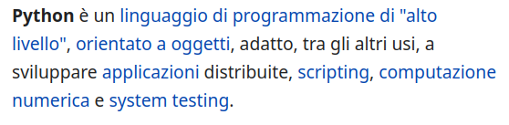

# Cosa è Python

---

# Si


# ma NO

---



---

# "Alto livello"

La gestione della memoria dinamica non è affidata al _programmatore_

---

Mentre il C o in C++ la memoria allocata nello heap

    malloc()
    calloc()
    realloc()

deve essere rilasciata esplicitamente per non causare memory leak

    free()

---

```c
#include "stdio.h"
#include "stdlib.h"

int main(){
    int dim = 10;
    int *p = malloc(dim * sizeof(int));

    for(int i=0; i<dim; i++){
        p[i] = i;
    }

    for(int i=0; i<dim; i++){
        printf("%d\n", p[i]);
    }

    return 0;
}
```

```sh
gcc -o main main.c
./main
```

---

```c
#include "stdio.h"
#include "stdlib.h"

int main(){
    int dim = 10;
    int *p = malloc(dim * sizeof(int));

    for(int i=0; i<dim; i++){
        p[i] = i;
    }

    for(int i=0; i<dim; i++){
        printf("%d\n", p[i]);
    }

    free(p); // evita memory leak, OK

    return 0;
}
```

---

```c
#include "stdio.h"
#include "stdlib.h"

int main(){
    int dim = 10;
    int *p = malloc(dim * sizeof(int));

    for(int i=0; i<dim; i++){
        p[i] = i;
    }

    for(int i=0; i<dim; i++){
        printf("%d\n", p[i]);
    }

    free(p); // evita memory leak, OK
    free(p); // double free, AHIA!

    return 0;
}
```

---

```python
dim = 10
l = []

for i in range(dim):
    l.append(i)

for i in l:
    print(i)
```

```sh
python main.py
```

oppure

```sh
python3 main.py
```

---

```python
def main():
    dim = 10
    l = []

    for i in range(dim):
        l.append(i)

    for i in l:
        print(i)

if __name__ == "__main__":
    main()
```

---

```python
def main():
    dim = 10
    l = []

    for i in range(dim):
        l.append(i)

    print(l)

if __name__ == "__main__":
    main()
```

---

```python
def main():
    dim = 10
    l = [i for i in range(dim)] # list comprehension


    print(l)

if __name__ == "__main__":
    main()
```

---

```python
def main():
    print([i for i in range(10)])

if __name__ == "__main__":
    main()
```

---

```python
print([i for i in range(10)])
```

---

# "Alto livello"

La gestione della memoria dinamica è affidata al _garbage collector_

...


---

# Interpretato

Nessuna fase di compilazione, l'interprete python analizza il codice scritto e lo esegue direttamente. È anche possibile usare le REPL di python eseguire codice senza scrivere su un file

---

# Scripting

Quando non hai sbatta di fare le cose a mano

---

e costringi il sistema operativo a farlo per te.

---

```python
import os

def main():
    os.makedirs("compiti", exist_ok=True)

    for i in range(20):
        with open(f"compiti/{i}.txt", "w") as f:
            f.write(f"ciao file {i}")
```

---

## Voglio sapere quante _c_ ha scritto Dante

---

```python
def main():
    cnt = 0

    with open("dante.txt", "r") as f:
        for line in f.readlines():
            words = line.split(" ")
            for w in words:
                cnt += w.lower().count("c")

    print(cnt)
```

---

## Voglio sapere quante volte Renzo e Lucia sono nominati ne I Promessi Sposi

---

```python
def main():
    renzo = 0
    lucia = 0

    with open("promessi_sposi.txt", "r") as f:
        for line in f.readlines():
            words = line.split(" ")
            for w in words:
                renzo += w.lower().count("renzo")
                lucia += w.lower().count("lucia")

    print(f"Renzo: {renzo}, Lucia: {lucia}")
```

---

## _e_ la parola più usata?

---

```python
def main():
    total_words = dict()

    with open("promessi_sposi.txt", "r") as f:
        for line in f.readlines():
            words = line.split(" ")
            for w in words:
                filtered = list(filter(lambda x: x.isalpha(), w.lower()))

                if len(filtered) > 0:
                    word = "".join(filtered)

                if word in total_words:
                    total_words[word] += 1
                else:
                    total_words.update({word: 1})

    print(dict(sorted(total_words.items(), key=lambda item: item[1])))
```

---


---

# Orientato agli oggetti

Tutto è un oggetto, che possiede determinati _attributi_ e _metodi_

---

# Attributo

Qualità dell'oggetto

---

# Metodo

Uso dell'oggetto

---

# Esempio:

## Penna

```text
attributi:
    livello inchiostro
    colore inchiostro
    marca
    tipo
    tappo
metodi:
    scrivi
    picchietta
    metti il tappo
    togli il tappo
```

---

```python
class Pen:
    def __init__(self, ink, style, color="black", trademark="Mattel"):
        self._ink = ink
        self._color = color
        self._style = style
        self._trademark = trademark
        self._top = True
```

---

```python
def write(self, text):
    if self._color == "red":
        head = "\033[91m"
    elif self._color == "blue":
        head = "\033[96m"
    else:
        head = "\033[98m"

    tail = "\033[00m"

    if not self._top and self._ink > len(text):
        print(f"{head}{text}{tail}")

        self._ink -= len(text)

def tap(self):
    print("Tip tap tip tap")

def plug(self):
    self._top = True

def unplug(self):
    self._top = False
```

---

```python
def __str__(self):
    return f"{self._color} {self.style} - {self.trademark}\n\tlivello inchiosto: {self.ink}"

@property
def ink(self):
    return self._ink

@property
def style(self):
    return self._style

@property
def trademark(self):
    return self._trademark

```

---

```python
class Pen:
    def __init__(self, ink, color, style, trademark="Mattel"):
        self._ink = ink
        self._color = color
        self._style = style
        self._trademark = trademark
        self._top = True

    def __str__(self):
        return f"{self._color} {self.style} - {self.trademark}\n\tlivello inchiosto: {self.ink}"

    @property
    def ink(self):
        return self._ink

    @property
    def style(self):
        return self._style

    @property
    def trademark(self):
        return self._trademark

    def write(self, text):
        if self._color == "red":
            head = "\033[91m"
        elif self._color == "blue":
            head = "\033[96m"
        else:
            head = "\033[98m"

        tail = "\033[00m"

        if not self._top and self._ink > len(text):
            print(f"{head}{text}{tail}")

            self._ink -= len(text)

    def tap(self):
        print("Tip tap tip tap")

    def plug(self):
        self._top = True

    def unplug(self):
        self._top = False

```

---

```python
class Pencil:
    ...

class Pen:
    ...

class Marker:
    ...
```

---

```python
class Writer:
    ...

class Pencil(Writer):
    def __init__(self):
        super().__init__()
        ...

class Pen(Writer):
    def __init__(self):
        super().__init__()
        ...
```

---

# OOP do it better

---

# Strutture dati

```python
lista = list() or []
tupla = tuple()
dizionario = dict() or {chiave: valore}
insieme = set() or {}
```

---

## Natalia Romanzi vuole sapere chi è il suo BFF

---

```python
def main():
    names = [
        "Stefano Ricevuto",
        "Stefano Strano",
        "Pietro Parcheggiatore",
        "Tonio Rigido",
        "Bruce Striscione",
    ]
    quality = [
        ("bello", 6),
        ("intelligente", 7),
        ("giovane", 5),
        ("ricco", 4),
        ("muscoloso", 8),
    ]
    value = [8, 7, 7.5, 8, 9]

    for i, name in enumerate(names):
        print(f"{name},\t{quality[i][0]},\t{quality[i][1]*value[i]}")
```

---

## Salvando tutto su un file csv (sì, tipo excel)

---

```python
import csv

def main():
    names = [
        "Stefano Ricevuto",
        "Stefano Strano",
        "Pietro Parcheggiatore",
        "Tonio Rigido",
        "Bruce Striscione",
    ]
    quality = [
        ("bello", 6),
        ("intelligente", 7),
        ("giovane", 5),
        ("ricco", 4),
        ("muscoloso", 8),
    ]
    value = [8, 7, 7.5, 8, 9]

    fields = ["Name", "Quality", "Friendship"]

    with open("bff.csv", "w", newline="") as f:
        writer = csv.DictWriter(f, fieldnames=fields, dialect="excel")
        writer.writeheader()

        for i, name in enumerate(names):
            writer.writerow(
                {
                    fields[0]: name,
                    fields[1]: quality[i][0],
                    fields[2]: quality[i][1] * value[i],
                }
            )
```

---

## E se volesse leggerlo un file csv?

Non va bene per niente, troppa sbatta e spreco di risorse

---

## Usiamo una classe

```python
class Friend:
    def __init__(self, name, quality, value):
        self._name = name
        self._quality = quality
        self._value = value

    @property
    def name(self):
        return self._name

    @property
    def value(self):
        return self._value * self.evaluate_quality(self._quality)

    @property
    def quality(self):
        return self._quality

    @staticmethod
    def evaluate_quality(quality):
        if quality == "bello":
            return 6
        elif quality == "intelligente":
            return 7
        elif quality == "giovane":
            return 5
        elif quality == "ricco":
            return 4
        elif quality == "muscoloso":
            return 8
        else:
            return 0
```

---

```python
def main():
    friends = [
        Friend("Stefano Ricevuto", "bello", 8),
        Friend("Stefano Strano", "intelligente", 7),
        Friend("Pietro Parcheggiatore", "giovane", 5),
        Friend("Tonio Rigido", "ricco", 4),
        Friend("Bruce Striscione", "muscoloso", 8),
    ]

    fields = ["Name", "Quality", "Friendship"]

    with open("bff.csv", "w", newline="") as f:
        writer = csv.DictWriter(f, fieldnames=fields, dialect="excel")
        writer.writeheader()

        for f in friends:
            writer.writerow(
                {
                    fields[0]: f.name,
                    fields[1]: f.quality,
                    fields[2]: f.value,
                }
            )

```

---

## Adesso lo possiamo leggere facile facile

---

```python
def main():
    friends = []
    fields = ["Name", "Quality", "Friendship"]

    with open("bff.csv", "r", newline="") as f:
        # skip header line
        f.readline()

        reader = csv.DictReader(f, fieldnames=fields, dialect="excel")

        for f in reader:
            friends.append(
                Friend(
                    f["Name"],
                    f["Quality"],
                    float(f["Friendship"]) / Friend.evaluate_quality(f["Quality"]),
                )
            )

    for f in friends:
        print(f)
```

---


